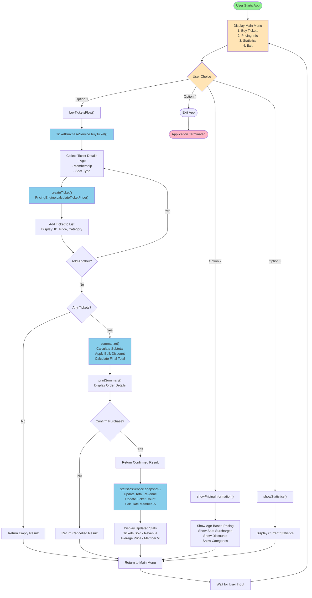
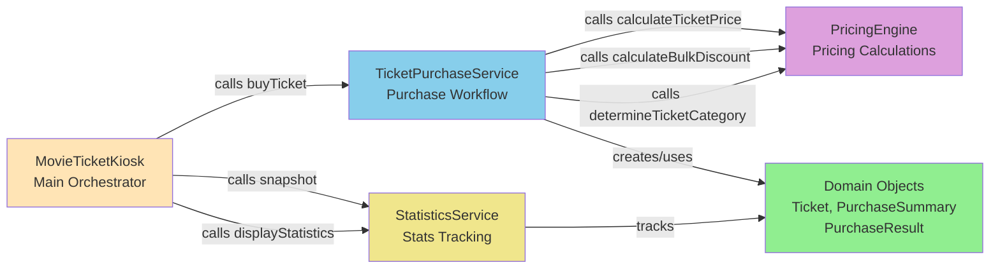
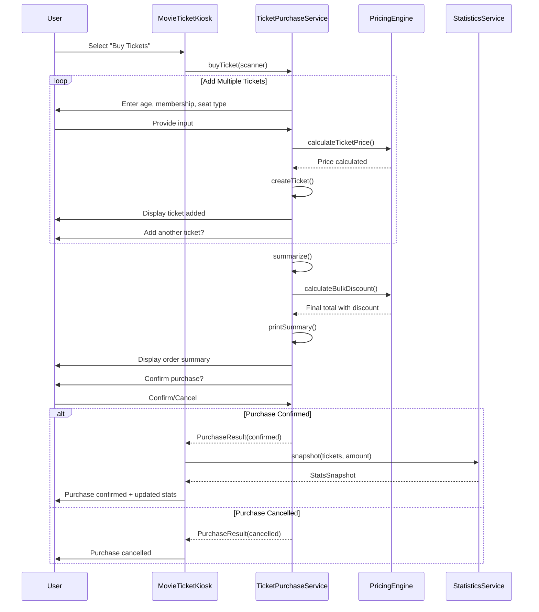

# MovieApp Project Structure

This module implements a CLI-based Movie Ticket Kiosk application. Below is the complete project structure for the `apps-final/movieapp` module:

```
apps-final/movieapp/
├── build.gradle.kts
├── IMPLEMENTATION_GUIDE.md
├── PROJECT_STRUCTURE.md
├── PROJECT_STRUCTURE_BENEFITS.md
├── REPLICATION_PROMPT.md
├── prompts.md
├── src/
│   ├── main/
│   │   └── java/
│   │       └── app/
│   │           ├── MovieTicketApp.java
│   │           ├── MovieTicketKiosk.java
│   │           ├── domain/
│   │           │   ├── SeatType.java
│   │           │   ├── Ticket.java
│   │           │   ├── PurchaseSummary.java
│   │           │   ├── PurchaseResult.java
│   │           │   └── StatsSnapshot.java
│   │           ├── service/
│   │           │   ├── PricingEngine.java
│   │           │   ├── TicketPurchaseService.java
│   │           │   └── StatisticsService.java
│   │           └── util/
│   │               └── AgeCategoryUtil.java
│   └── test/
│       └── java/
│           └── app/
│               └── PricingEngineTest.java
```

## Structure Overview

### Root Level
- **build.gradle.kts** - Gradle build configuration
- **IMPLEMENTATION_GUIDE.md** - Detailed implementation guide
- **PROJECT_STRUCTURE.md** - This file, describing the project structure
- **PROJECT_STRUCTURE_BENEFITS.md** - Benefits and rationale of the project structure
- **REPLICATION_PROMPT.md** - Prompt for replication and testing
- **prompts.md** - Implementation prompts and guidance

### Source Code Organization

#### **app/** - Entry Points and Orchestrators
- **MovieTicketApp.java** - Main entry point for the application
- **MovieTicketKiosk.java** - Interactive kiosk interface handling user interactions

#### **app/domain/** - Domain Model
- **SeatType.java** - Enum representing seat types (Standard, Premium, VIP)
- **Ticket.java** - Core domain object representing a single ticket
- **PurchaseSummary.java** - Aggregates ticket purchase details and pricing
- **PurchaseResult.java** - Result wrapper for purchase operations (success/failure)
- **StatsSnapshot.java** - Immutable snapshot of current statistics

#### **app/util/** - Utility Classes
- **AgeCategoryUtil.java** - Utility for age categorization and discount calculations

#### **app/service/** - Business Logic Layer
- **PricingEngine.java** - Calculates ticket prices based on seat type and age category
- **TicketPurchaseService.java** - Orchestrates the complete ticket purchase workflow with input validation, ticket creation, summarization, and confirmation
- **StatisticsService.java** - Tracks and calculates sales statistics

#### **test/java/app/** - Unit Tests
- **PricingEngineTest.java** - JUnit 5 tests for the PricingEngine service

---

## Key Components

### Pricing Logic
- Base prices vary by seat type
- Age-based discounts: Children (≤12 years) 25%, Seniors (≥60 years) 30%
- Bulk purchase considerations

### Domain Model
- Immutable domain objects for type safety
- Clean separation between value objects and services
- Result types for error handling

### Service Architecture
- Single unified TicketPurchaseService for all ticket purchase operations
- Pricing calculations isolated in PricingEngine
- Statistics tracking in StatisticsService
- Clean separation of concerns with minimal dependencies

---

## Application Flow Diagram

### Complete Ticket Purchase Flow



### Service Interaction Diagram



### Data Flow During Purchase



---

## Getting Started

- Refer to `IMPLEMENTATION_GUIDE.md` for detailed implementation specifications
- Check `PROJECT_STRUCTURE_BENEFITS.md` for the rationale behind this structure
- See `prompts.md` for development guidance
- Use `REPLICATION_PROMPT.md` for testing and replication scenarios
