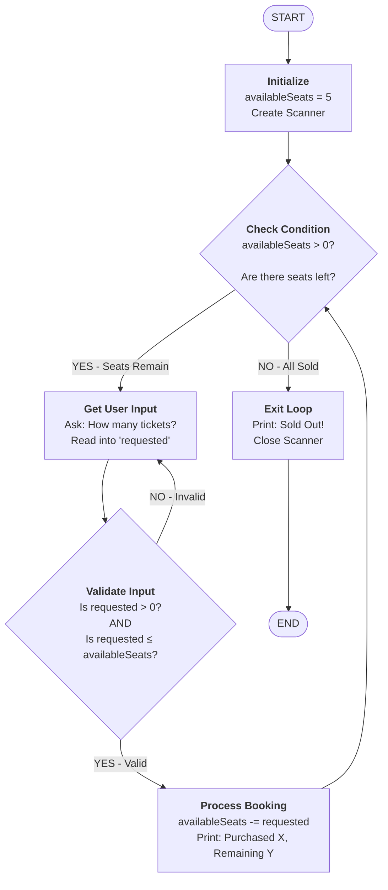

# Flow Diagram: checkAvailableSeatsLogic()

## Overview
A cinema seat booking system that simulates a ticket counter using a **while loop**. The program continuously asks customers how many tickets they want to purchase until all 5 cinema seats are sold out. This demonstrates loop control, input validation, and user interaction.

---

## Simple Flow Diagram with Descriptions

```
START
  │
  ├─> Initialize Variables
  │   └─ Create availableSeats = 5 (cinema capacity)
  │   └─ Create Scanner object to read user input
  │
  └─> WHILE availableSeats > 0  ← Loop runs as long as seats are available
       │
       ├─> Prompt User
       │   └─ Display: "How many tickets would you like to buy?"
       │   └─ Read integer input into 'requested' variable
       │
       ├─> Validate Input (Two checks combined)
       │   ├─ Check 1: Is requested > 0? (Customer must want at least 1 ticket)
       │   ├─ Check 2: Is requested ≤ availableSeats? (Can't buy more than available)
       │   │
       │   ├─ If INVALID (either check fails)
       │   │  └─ Show error message and GO BACK to Prompt User
       │   │
       │   └─ If VALID (both checks pass)
       │      └─ Continue to booking
       │
       ├─> Process Booking
       │   └─ Deduct tickets: availableSeats = availableSeats - requested
       │   └─ Display confirmation: "Purchased X ticket(s). Remaining: Y"
       │
       └─ Loop back to check: availableSeats > 0?
  
  └─> Exit Loop (When availableSeats = 0)
      └─ Print "Sorry, all seats are sold out!"
      └─ Close Scanner resource
      └─ END
```

---

## Mermaid Flow Diagram (Simplified)



---

## Step-by-Step Logic Explanation

| Step | What Happens | Why It Matters |
|------|--------------|----------------|
| 1 | **Initialize**: Set `availableSeats = 5` and create a `Scanner` | Establishes the cinema capacity and sets up user input |
| 2 | **Loop Condition Check**: `while (availableSeats > 0)` | Ensures the loop only runs when seats are available |
| 3 | **Get Input**: Ask customer "How many tickets would you like to buy?" | Captures what the customer wants |
| 4 | **Validate Input**: Check if `requested > 0` | Prevents invalid entries like 0 or negative numbers |
| 5 | **Validate Availability**: Check if `requested ≤ availableSeats` | Prevents overbooking (can't sell more than available) |
| 6 | **If Invalid**: Show error message and ask again | Ensures data integrity before processing |
| 7 | **If Valid**: Deduct seats: `availableSeats -= requested` | Updates the inventory |
| 8 | **Confirm Purchase**: Display how many purchased and remaining seats | Provides feedback to customer |
| 9 | **Loop Back**: Return to Step 2 | Allows next customer or sale if seats remain |
| 10 | **Exit**: When `availableSeats = 0`, print "Sold out!" | Gracefully ends the program |

---

## Key Programming Concepts

| Concept | How It's Used | Explanation |
|---------|--------------|-------------|
| **while loop** | `while (availableSeats > 0)` | Repeats code block as long as condition is TRUE. Exits when condition becomes FALSE |
| **continue statement** | Used when input is invalid | Skips remaining loop code and jumps back to condition check. Effectively asks user again |
| **Input Validation** | Two checks combined with `\|\|` (OR) | Ensures input is positive AND doesn't exceed available seats |
| **Compound Condition** | `if (requested <= 0 \|\| requested > availableSeats)` | Checks multiple conditions; if ANY is true, input is invalid |
| **Variable Update** | `availableSeats -= requested` | Subtracts purchased tickets from available inventory |
| **Resource Management** | `sc.close()` | Properly closes Scanner to free system resources |

---

## Execution Flow Example with Annotations

```
=== PROGRAM START ===
Welcome to CineMax! Seats available: 5

[ITERATION 1]
How many tickets would you like to buy? -2
❌ Invalid input: Please enter at least 1.
   (Loop continues, asks again)

How many tickets would you like to buy? 10
❌ Invalid input: Only 5 left. Try a smaller number.
   (Loop continues, asks again)

How many tickets would you like to buy? 3
✓ Valid! Purchased 3 ticket(s). Remaining: 2
   (availableSeats updated from 5 to 2)

[ITERATION 2]
How many tickets would you like to buy? 1
✓ Valid! Purchased 1 ticket(s). Remaining: 1
   (availableSeats updated from 2 to 1)

[ITERATION 3]
How many tickets would you like to buy? 2
❌ Invalid input: Only 1 left. Try a smaller number.
   (Loop continues, asks again)

How many tickets would you like to buy? 1
✓ Valid! Purchased 1 ticket(s). Remaining: 0
   (availableSeats updated from 1 to 0)

[LOOP CONDITION CHECK]
Is availableSeats > 0?  → NO (availableSeats = 0)
Exit loop!

=== PROGRAM END ===
Sorry, all seats are sold out!
```

---

## Why This Pattern is Useful

- **Real-world application**: Mimics actual ticket booking systems
- **Input validation**: Shows how to handle user errors gracefully
- **Loop control**: Demonstrates `while`, `continue`, and loop conditions
- **State management**: Tracks inventory and updates it correctly
- **User experience**: Keeps asking until valid input is provided
