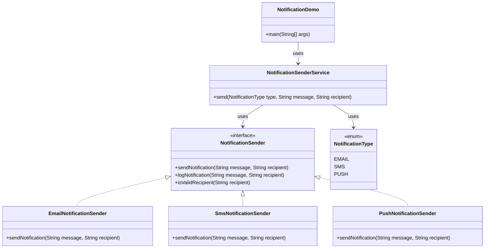

```mermaid
classDiagram
    class NotificationSender {
    <<interface>>
    +sendNotification(String message, String recipient)
    +logNotification(String message, String recipient)
    +isValidRecipient(String recipient)
    }
    class EmailNotificationSender {
    +sendNotification(String message, String recipient)
    }
    class SmsNotificationSender {
    +sendNotification(String message, String recipient)
    }
    class PushNotificationSender {
    +sendNotification(String message, String recipient)
    }
    class NotificationSenderService {
    +send(NotificationType type, String message, String recipient)
    }
    class NotificationType {
    <<enum>>
    EMAIL
    SMS
    PUSH
    }
    class NotificationDemo {
    +main(String[] args)
    }
    
        NotificationSender <|.. EmailNotificationSender
        NotificationSender <|.. SmsNotificationSender
        NotificationSender <|.. PushNotificationSender
        NotificationSenderService --> NotificationSender : uses
        NotificationSenderService --> NotificationType : uses
        NotificationDemo --> NotificationSenderService : uses
```