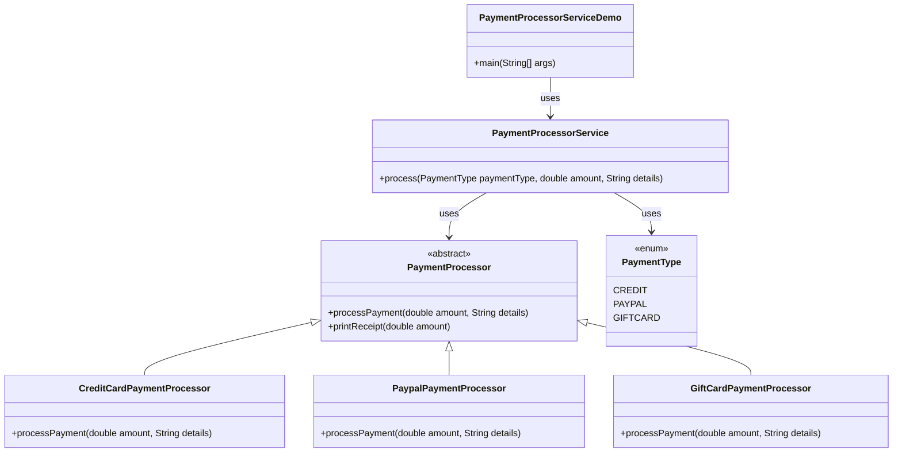

```mermaid
    classDiagram
        class PaymentProcessorService {
            +process(PaymentType paymentType, double amount, String details)
        }
        class PaymentProcessor {
            <<abstract>>
            +processPayment(double amount, String details)
            +printReceipt(double amount)
        }
        class CreditCardPaymentProcessor {
            +processPayment(double amount, String details)
        }
        class PaypalPaymentProcessor {
            +processPayment(double amount, String details)
        }
        class GiftCardPaymentProcessor {
            +processPayment(double amount, String details)
        }
        class PaymentType {
            <<enum>>
            CREDIT
            PAYPAL
            GIFTCARD
        }
        class PaymentProcessorServiceDemo {
            +main(String[] args)
        }
    
        PaymentProcessor <|-- CreditCardPaymentProcessor
        PaymentProcessor <|-- PaypalPaymentProcessor
        PaymentProcessor <|-- GiftCardPaymentProcessor
        PaymentProcessorService --> PaymentProcessor : uses
        PaymentProcessorService --> PaymentType : uses
        PaymentProcessorServiceDemo --> PaymentProcessorService : uses
```

