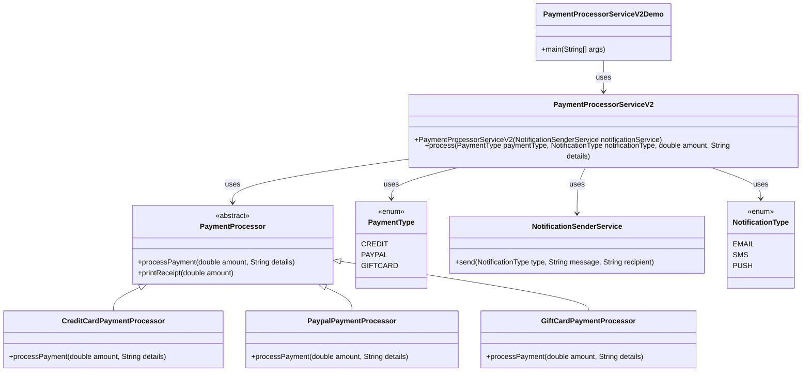

```mermaid
classDiagram
    class PaymentProcessorServiceV2 {
        +PaymentProcessorServiceV2(NotificationSenderService notificationService)
        +process(PaymentType paymentType, NotificationType notificationType, double amount, String details)
    }
    class PaymentProcessor {
        <<abstract>>
        +processPayment(double amount, String details)
        +printReceipt(double amount)
    }
    class CreditCardPaymentProcessor {
        +processPayment(double amount, String details)
    }
    class PaypalPaymentProcessor {
        +processPayment(double amount, String details)
    }
    class GiftCardPaymentProcessor {
        +processPayment(double amount, String details)
    }
    class PaymentType {
        <<enum>>
        CREDIT
        PAYPAL
        GIFTCARD
    }
    class NotificationSenderService {
        +send(NotificationType type, String message, String recipient)
    }
    class NotificationType {
        <<enum>>
        EMAIL
        SMS
        PUSH
    }
    class PaymentProcessorServiceV2Demo {
        +main(String[] args)
    }

    PaymentProcessor <|-- CreditCardPaymentProcessor
    PaymentProcessor <|-- PaypalPaymentProcessor
    PaymentProcessor <|-- GiftCardPaymentProcessor
    PaymentProcessorServiceV2 --> PaymentProcessor : uses
    PaymentProcessorServiceV2 --> NotificationSenderService : uses
    PaymentProcessorServiceV2 --> PaymentType : uses
    PaymentProcessorServiceV2 --> NotificationType : uses
    PaymentProcessorServiceV2Demo --> PaymentProcessorServiceV2 : uses
```

